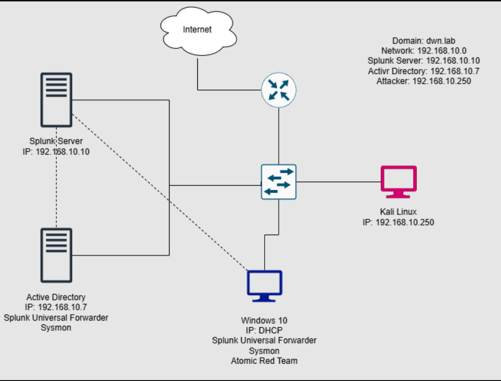
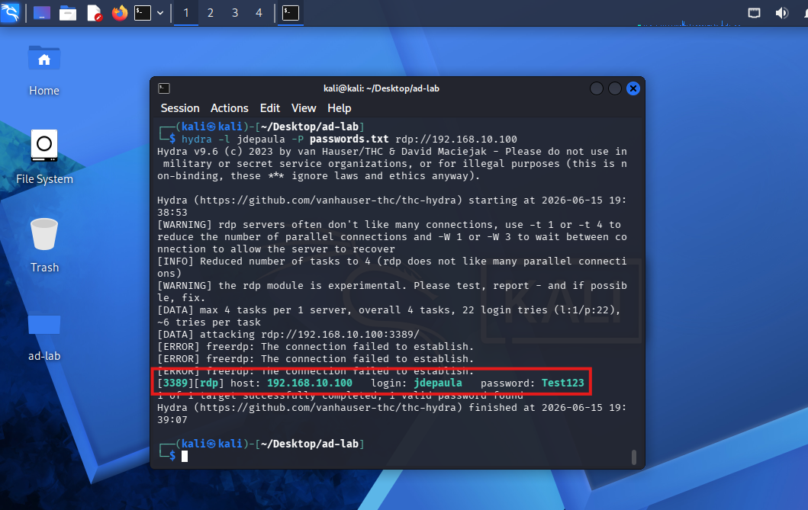
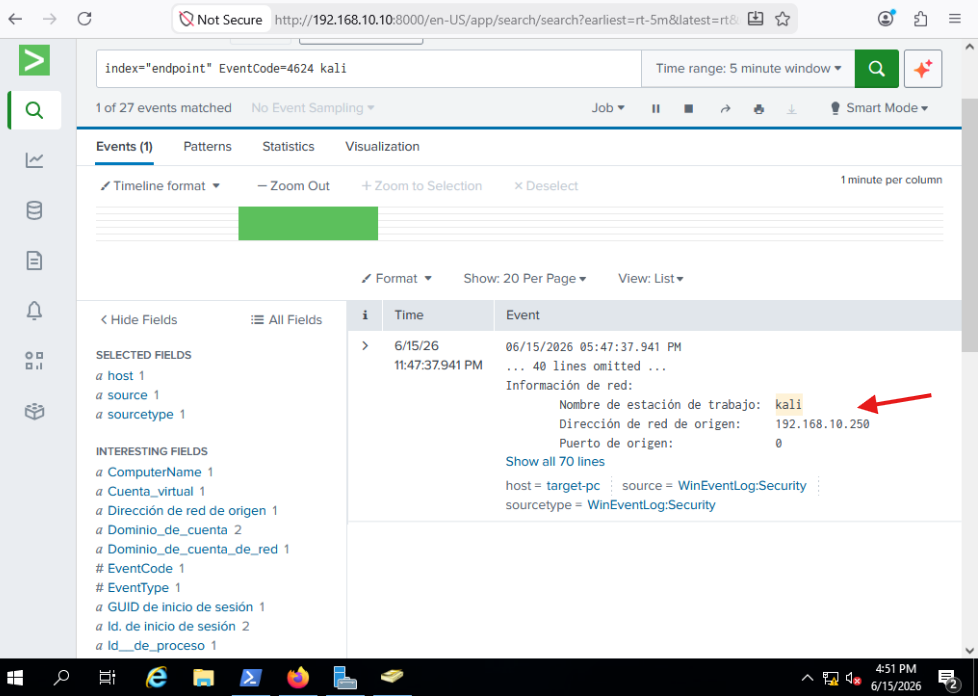
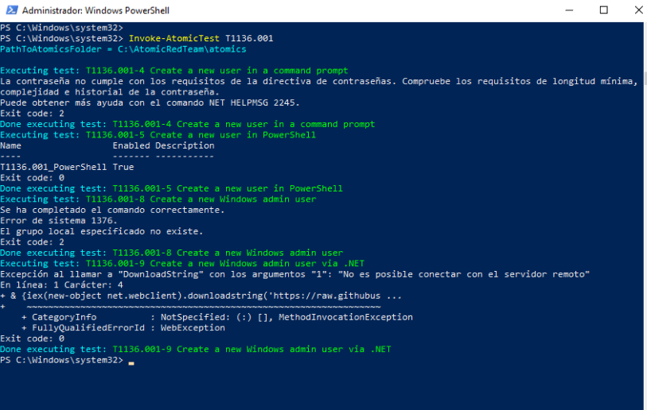
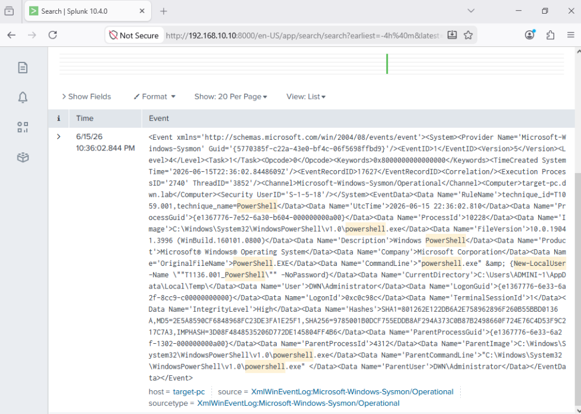
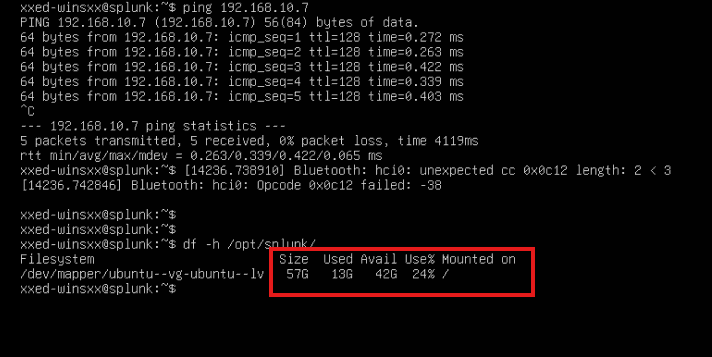

# Active Directory SOC Detection Lab

**By Edwin De Paula**

> A self-built blue-team detection environment simulating a small enterprise network: Active Directory domain, centralized Splunk logging, Sysmon-instrumented endpoints, and a Kali Linux attacker. Adversary techniques are executed with Atomic Red Team, then detected end-to-end in Splunk and mapped to MITRE ATT&CK.


---

## Table of Contents

1. [Overview](#overview)
2. [Lab Architecture](#lab-architecture)
3. [Components & Build](#components--build)
4. [Network Configuration](#network-configuration)
5. [Detection Pipeline](#detection-pipeline)
6. [Attack Simulation & Detection](#attack-simulation--detection)
7. [Troubleshooting Log](#troubleshooting-log)
8. [Lessons Learned](#lessons-learned)
9. [Next Steps](#next-steps)

---

## Overview

This project documents the design and construction of a functional **Security Operations Center (SOC) detection lab** built from scratch in VMware Workstation. The goal was to create a realistic environment where offensive techniques can be executed and then **detected through a centralized logging pipeline**, replicating the core workflow of a blue-team analyst.

The lab demonstrates the complete **attack → log → detection** cycle:

- An attacker (Kali Linux) executes techniques against domain-joined endpoints.
- Endpoints generate Windows Security and **Sysmon** telemetry.
- A **Splunk Universal Forwarder** ships logs to a central Splunk indexer.
- Detections are built in Splunk and mapped to **MITRE ATT&CK**.

**Domain:** `dwn.lab` &nbsp;|&nbsp; **Network:** `192.168.10.0/24`

---

## Lab Architecture



<!-- SCREENSHOT: Export your draw.io network diagram (the one with the domain, IPs, and all hosts) as PNG and save it as images/network-architecture.png -->

| Host | IP | Role |
|------|-----|------|
| **Splunk Server** | `192.168.10.10` | Central indexer / search head |
| **Active Directory** | `192.168.10.7` | Domain Controller (`dwn.lab`), Splunk UF, Sysmon |
| **Windows 10** | `192.168.10.100` (static) | Domain-joined endpoint, Splunk UF, Sysmon, Atomic Red Team |
| **Kali Linux** | `192.168.10.250` | Attacker / offensive tooling |

---

## Components & Build

### Splunk Server (Ubuntu Server)
- Splunk Enterprise as the central indexer and search head.
- Receives forwarded data on the standard receiving port (9997).
- Web UI exposed on `:8000` for searching and dashboards.

### Active Directory (Windows Server)
- Promoted to Domain Controller for `dwn.lab`.
- **Sysmon** installed for deep process/network telemetry.
- **Splunk Universal Forwarder** shipping Security + Sysmon logs.

### Windows 10 Endpoint
- Joined to the `dwn.lab` domain.
- **Sysmon** + **Splunk Universal Forwarder** installed.
- **Atomic Red Team** for adversary emulation.
- Static IP for deterministic lab behavior (see [Network Configuration](#network-configuration)).

### Kali Linux Attacker
- Primary offensive machine for the lab, loaded with standard offensive tooling.
- Tools used: `nmap`, `hydra`, `crowbar`.

---

## Network Configuration

All VMs share a custom **VMnet in NAT mode** on `192.168.10.0/24`, gateway at `.1`.

**Key design decision — static IPs outside the DHCP pool.** Early in the build, the Windows 10 endpoint suffered from intermittent connectivity that turned out to be a short DHCP lease (~22 min) colliding with stale NAT/DHCP state on the host. The fix that made the lab deterministic:

- Assigned **static IPs** to the servers and the Windows 10 endpoint.
- **Narrowed the VMware DHCP pool** in the Virtual Network Editor so it no longer overlapped the static addresses (`.10`, `.100`).

| Setting | Value |
|---------|-------|
| IP (Win10) | `192.168.10.100` |
| Subnet Mask | `255.255.255.0` |
| Gateway | `192.168.10.1` |
| DNS | `192.168.10.7` |

> **Takeaway:** In a detection lab, deterministic networking matters. A flapping endpoint IP breaks Universal Forwarder connectivity mid-exercise and wastes time chasing phantom Splunk problems.

---

## Detection Pipeline

```
  ┌──────────────┐     Windows Security      ┌──────────────┐     ┌──────────────┐
  │  Endpoints   │ ──────  + Sysmon  ──────▶  │   Splunk     │ ──▶ │   Searches   │
  │ (Win10 / AD) │     Universal Forwarder    │   Indexer    │     │  + ATT&CK    │
  └──────────────┘                            └──────────────┘     └──────────────┘
```

**Telemetry sources:**
- **Windows Security Event Log** — authentication, account management (4624, 4625, 4720, 4732…).
- **Sysmon** — process creation (Event ID 1), network connections, and more granular host activity.

**Transport:** Splunk Universal Forwarder on each endpoint ships to the indexer at `192.168.10.10:9997`.

---

## Attack Simulation & Detection

Two MITRE ATT&CK techniques were executed end-to-end and are detectable in the pipeline.

### T1110 — Brute Force (RDP)

**Attack (from Kali):**
```bash
# Confirm RDP is listening
nmap -p 3389 192.168.10.100

# Brute force RDP with a password list
hydra -l jdepaula -P passwords.txt rdp://192.168.10.100
```



<!-- SCREENSHOT: Terminal showing hydra finding the valid password (the green [3389][rdp] host: ... login: ... password: ... line). Save as images/hydra-success.png -->

> **Tooling note:** `crowbar` was tried first but failed against modern Windows 10 RDP — its aging `xfreerdp` wrapper breaks the NLA handshake and reports every credential as invalid even when one is correct. `hydra` handled the handshake correctly and succeeded. **Lesson: when an RDP brute-force tool reports universal failure, suspect the tool/NLA before the target config.**

**Detection signal:**
| Event ID | Meaning |
|----------|---------|
| `4625` | Failed logon — a burst of these, one per wrong password |
| `4624` (Logon Type 10) | Successful **RemoteInteractive** (RDP) logon |

**Detection pattern:** many `4625` events from a single source IP (`192.168.10.250`), followed by a `4624` with `Logon_Type=10` from the same source.

```
index="endpoint" EventCode=4624 kali

```



<!-- SCREENSHOT: Splunk search results showing the 4625 burst + 4624 Logon Type 10 from the Kali IP. This is the most important screenshot — it proves the full pipeline works end-to-end. Save as images/splunk-t1110-detection.png -->

---

### T1136.001 — Create Account: Local Account

**Attack (from the Win10 endpoint):**
```powershell
Invoke-AtomicTest T1136.001
```



<!-- SCREENSHOT: PowerShell output of Invoke-AtomicTest T1136.001 showing the sub-test results. Optional but nice. Save as images/atomic-t1136.png -->

**Results observed across sub-tests:**
| Test | Result | Note |
|------|--------|------|
| `-4` (cmd) | Blocked | Password failed the **domain password policy** (complexity) — expected, the GPO worked |
| `-5` (PowerShell) | Success | `New-LocalUser` created the account |
| `-8` (admin user) | Partial | User created, but group add failed — Spanish Windows uses `Administradores`, not `Administrators` |
| `-9` (.NET) | Blocked | Outbound fetch to `raw.githubusercontent.com` failed (network/DNS) |

> Two of these tests **created real accounts**, generating exactly the telemetry a SOC should catch.

**Detection signal:**
| Event ID | Meaning |
|----------|---------|
| `4720` | A user account was created |
| `4732` | A member was added to a security-enabled local group |
| Sysmon `1` | Process creation — `net user` / `New-LocalUser` execution |

```
index="endpoint" New-LocalUser powershell
```



<!-- SCREENSHOT: Splunk search showing the 4720 (account created) events generated by the atomic tests, ideally correlated with the Sysmon process. Save as images/splunk-t1136-detection.png -->

---

## Troubleshooting Log

Real problems encountered and resolved during the build — included because troubleshooting *is* the skill.

| # | Problem | Root Cause | Fix |
|---|---------|-----------|-----|
| 1 | Win10 no internet in NAT (Linux VM fine) | Stale host NAT/DHCP state + short DHCP lease | Static IP outside DHCP pool; restart VMware NAT/DHCP services |
| 2 | Connectivity dropped every ~22 min | DHCP lease renewal colliding with stale NAT state | Static IP killed the renewal cycle |
| 3 | Splunk halted searches | Disk below 5 GB free threshold on `/opt/splunk` | Expanded virtual disk (3-stage LVM grow) |
| 4 | Expanded disk not visible in OS | Filesystem not grown after disk resize | `growpart` → `lvextend -l +100%FREE` → `resize2fs` |
| 5 | Invisible cursor in Linux VM | Graphics driver/virtual-hardware mismatch after updates | Raised VM Hardware Compatibility version |
| 6 | `crowbar` RDP brute force failed | Aging xfreerdp wrapper vs. Win10 NLA | Switched to `hydra` |

### Disk expansion (LVM) — the 3-stage grow

A frequent gotcha: expanding the virtual disk in VMware does **not** grow the filesystem. Three layers must be extended in order.

```bash
# 1. Grow the partition to claim the new disk space
sudo growpart /dev/sda 3

# 2. Extend the LVM logical volume into the freed space
sudo lvextend -l +100%FREE /dev/ubuntu-vg/ubuntu-lv

# 3. Grow the ext4 filesystem on top
sudo resize2fs /dev/ubuntu-vg/ubuntu-lv

# Verify
df -h /opt/splunk/
```



<!-- SCREENSHOT: df -h output showing the grown filesystem (the Size jumping to the new total). Optional, reinforces the troubleshooting section. Save as images/disk-expanded.png -->

---

## Lessons Learned

- **Deterministic infrastructure first.** Static IPs and a clean DHCP scope eliminated an entire class of intermittent failures that masqueraded as Splunk problems.
- **The OS sits below the application.** A "Splunk stopped searching" error was really a full disk — always check the layers underneath before debugging the app.
- **Tools are not interchangeable.** `crowbar` and `hydra` target the same protocol but handle the RDP/NLA handshake differently. When a tool reports universal failure, suspect the tool before the target.
- **Localization matters in offensive tooling.** Atomic tests hardcoded for `Administrators` fail silently on Spanish-language Windows (`Administradores`).
- **Troubleshooting is the deliverable.** A lab that built perfectly on the first try teaches less than one fought into existence.

---

## Next Steps

- [ ] Build saved searches / alerts in Splunk for T1110 and T1136.001.
- [ ] Expand Atomic Red Team coverage (persistence, lateral movement, exfiltration).
- [ ] Add dashboards mapping detections to the MITRE ATT&CK matrix.
- [ ] Tune index retention (`frozenTimePeriodInSecs`) to keep disk usage bounded.
- [ ] Snapshot each VM in a known-good state for fast lab recovery.

---

## MITRE ATT&CK Coverage

| Technique | ID | Tactic | Status |
|-----------|-----|--------|--------|
| Brute Force | T1110 | Credential Access | Detected |
| Create Account: Local Account | T1136.001 | Persistence | Detected |

---

**Built as a hands-on blue-team / detection engineering project.**
*Demonstrating SOC pipeline design, adversary emulation, and ATT&CK-mapped detection.*

**Author:** Edwin De Paula — Information Security student @ ITLA, transitioning into cybersecurity.
